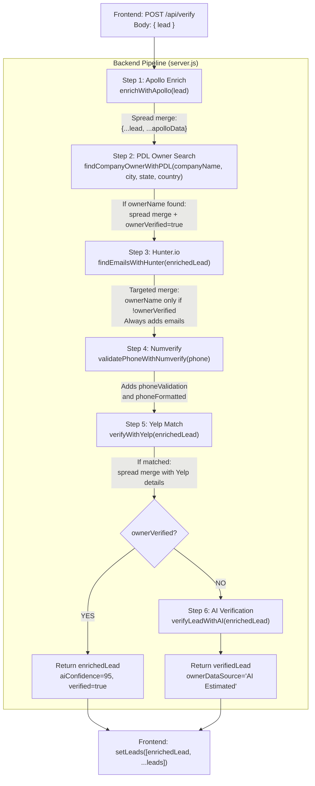

# SSAI Leads Pro - System Documentation

## Table of Contents

1. [Map Search Flow](#1-map-search-flow)
2. [Text Search Flow](#2-text-search-flow)
3. [Find Contacts Flow](#3-find-contacts-flow)
4. [Verify Lead Flow](#4-verify-lead-flow)
5. [Frontend API Calls](#5-frontend-api-calls)
6. [Backend External API Calls](#6-backend-external-api-calls)
7. [Rate Limits and Quotas](#7-rate-limits-and-quotas)
8. [Verify Pipeline Deep Dive](#8-verify-pipeline-deep-dive)

---

## 1. Map Search Flow

**Tab:** Map Search
**Frontend trigger:** User clicks "Scrape Selected Area"
**Backend endpoint:** `POST /api/scrape-area`

### Frontend Options

| Option | Type | Description |
|--------|------|-------------|
| Location search bar | Text input | Geocodes a location to center the map |
| Drawing tools | Circle, Polygon, Rectangle, Polyline, Multi-Polygon | User draws an area on the Google Map |
| Industry | Text input | Business type to search for (e.g., "restaurants") |
| Country | Text input (optional) | Filter by country |
| Zip Code | Text input (optional) | Filter by zip code |
| Maximum Leads | Number input (default 60) | Cap on results returned |
| Use Apollo Search | Checkbox (off by default) | Use Apollo instead of Google Places for scraping |
| Use Yelp Search | Checkbox (off by default) | **Not implemented on backend** - checkbox exists but the flag is not used |

### Flow

```
User draws area on map
        |
        v
User fills in Industry + options
        |
        v
Clicks "Scrape Selected Area"
        |
        v
Frontend sends POST /api/scrape-area
  Body: { query, area, country, zipcode, maxLeads, useApolloSearch }
        |
        v
Backend: Calculate area center
        |
        v
Backend: Reverse geocode center --> Google Geocoding API (1 call)
        |
        v
[If multipolygon: repeat the following for each polygon]
        |
        +--> [If useApolloSearch = false (default)]
        |       |
        |       v
        |    Google Places Text Search (1-3 pages, up to 60 results)
        |       |
        |       v
        |    Google Places Details (1 call per result, up to 60)
        |       |
        |       v
        |    [If maxLeads > 60: subdivides into grid cells, repeats above per cell]
        |
        +--> [If useApolloSearch = true]
                |
                v
             Apollo Organization Search (paginated, 1-N calls)
        |
        v
Deduplicate results by placeId
        |
        v
Return results to frontend
```

### External API Calls (per single-area scrape, Google mode, 60 leads)

| API | Endpoint | Calls |
|-----|----------|-------|
| Google Geocoding | `GET /maps/api/geocode/json` (reverse) | 1 |
| Google Places Text Search | `GET /maps/api/place/textsearch/json` | 1-3 |
| Google Places Details | `GET /maps/api/place/details/json` | Up to 60 |
| **Total** | | **~64** |

---

## 2. Text Search Flow

**Tab:** Text Search
**Frontend trigger:** User clicks "Start Scraping"
**Backend endpoint:** `POST /api/scrape`

### Frontend Options

| Option | Type | Description |
|--------|------|-------------|
| Industry | Text input | Business type to search for |
| Location | Text input | City, region, or area to search in |
| Country | Text input (optional) | Filter by country |
| Zip Code | Text input (optional) | Filter by zip code |
| Maximum Leads | Number input (default 60) | Cap on results returned |
| Use Apollo Search | Checkbox (off by default) | Use Apollo instead of Google Places |
| Use Yelp Search | Checkbox (off by default) | **Not implemented on backend** - checkbox exists but the flag is not used |

### Flow

```
User fills in Industry + Location + options
        |
        v
Clicks "Start Scraping"
        |
        v
Frontend sends POST /api/scrape
  Body: { query, location, country, zipcode, maxLeads, useApolloSearch }
        |
        v
+--> [If useApolloSearch = false (default)]
|       |
|       v
|    [If maxLeads <= 60: single search]
|       Google Places Text Search (1-3 pages)
|       Google Places Details (1 per result)
|       [If < 30% results: broader fallback search (1 more Text Search)]
|       |
|    [If maxLeads > 60: auto-subdivide into grid]
|       Forward geocode location --> Google Geocoding API (1 call)
|       Generate grid cells (ceil(maxLeads * 1.5 / 60) cells)
|       For each cell: Text Search + Details (same as above)
|
+--> [If useApolloSearch = true]
        |
        v
     Apollo Organization Search (paginated)
        |
     [If 0 results with company name: retry with keywords]
        |
        v
Return results to frontend
```

### External API Calls (Google mode, 60 leads)

| API | Endpoint | Calls |
|-----|----------|-------|
| Google Places Text Search | `GET /maps/api/place/textsearch/json` | 1-3 |
| Google Places Details | `GET /maps/api/place/details/json` | Up to 60 |
| Broader fallback (if needed) | `GET /maps/api/place/textsearch/json` | 0-1 |
| **Total** | | **~63** |

### External API Calls (Apollo mode)

| API | Endpoint | Calls |
|-----|----------|-------|
| Apollo Organization Search | `POST api.apollo.io/api/v1/mixed_companies/search` | 1-N pages |
| **Total** | | **1-5 typically** |

---

## 3. Find Contacts Flow

**Tab:** Find Contacts
**Frontend trigger:** User clicks "Enrich & Add Lead"
**Backend endpoint:** `POST /api/enrich-manual`

### Frontend Options

| Option | Type | Description |
|--------|------|-------------|
| Company Name | Text input | Name of the business |
| Industry / Category | Text input | Type of business |
| Address | Text input | Street address |
| City | Text input | City |
| Zip Code | Text input | Postal code |
| Country | Text input | Country |
| Phone | Text input | Phone number |
| Owner Name | Text input | Known owner/contact name |

All fields are optional, but at least one must be filled.

### Flow

```
User fills in any combination of fields
        |
        v
Clicks "Enrich & Add Lead"
        |
        v
Frontend sends POST /api/enrich-manual
  Body: { companyName, industry, ownerName, phone, address, zipcode, city, country }
        |
        v
Backend: Try 3 search strategies in order (stop after first success):
        |
        +--> Strategy 1: Search by phone number
        |       Google Find Place From Text (1 call)
        |       Google Place Details (1 call)
        |
        +--> Strategy 2: Search by address (if Strategy 1 found nothing)
        |       Google Text Search (1 call)
        |       Google Place Details (up to 3 calls for top matches)
        |
        +--> Strategy 3: Search by company name (if Strategy 2 found nothing)
                Google Places full scrape (same as Text Search flow, max 5 results)
        |
        v
Find best match from results (exact name match > partial match > first result)
        |
        v
Merge scraped data with user-provided data (user data overrides where present)
        |
        v
AI Verification (verifyLeadWithAI):
        |
        +--> Claude API (1 call) - guess/verify owner name
        +--> ChatGPT API (1 call) - guess/verify owner name
        |
        v
Return enriched lead to frontend
```

### External API Calls (worst case)

| API | Endpoint | Calls |
|-----|----------|-------|
| Google Find Place | `GET /maps/api/place/findplacefromtext/json` | 0-1 |
| Google Text Search | `GET /maps/api/place/textsearch/json` | 0-1 |
| Google Place Details | `GET /maps/api/place/details/json` | 1-3 |
| Claude (Anthropic) | `POST api.anthropic.com/v1/messages` | 1 |
| ChatGPT (OpenAI) | `POST api.openai.com/v1/chat/completions` | 1 |
| **Total** | | **3-7** |

**Note:** Find Contacts always calls AI verification (Claude + ChatGPT) regardless of whether an owner was found. It does NOT go through the full verify pipeline (no Apollo enrichment, PDL, Hunter, Numverify, or Yelp).

---

## 4. Verify Lead Flow

**Frontend trigger:** User clicks "Verify & Add" on a single lead, or "Verify All"
**Backend endpoint:** `POST /api/verify`

### Flow

```
Frontend sends POST /api/verify
  Body: { lead }
        |
        v
Step 1: Apollo Enrichment
        Apollo People Match (1 call)
        |
        v
Step 2: People Data Labs Owner Search
        PDL Person Search (1 call)
        [If owner found: set ownerVerified = true]
        |
        v
Step 3: Hunter.io Email Search
        Hunter Domain Search (1 call)
        [If owner found AND not already verified by PDL: set ownerVerified = true]
        |
        v
Step 4: Numverify Phone Validation
        Numverify Validate (1 call)
        [Only if lead has a phone number]
        |
        v
Step 5: Yelp Business Match + Details
        Yelp Business Match (1 call)
        [If matched: Yelp Business Details (1 call)]
        |
        v
Step 6: AI Verification (ONLY if ownerVerified is still false)
        |
        +--> [If owner already verified by PDL/Hunter]
        |       Skip AI, set aiConfidence = 95, return
        |
        +--> [If owner NOT verified]
                Claude API (1 call)
                ChatGPT API (1 call)
                Merge results using 60% confidence threshold
```

### External API Calls (per lead, worst case)

| Step | API | Endpoint | Calls |
|------|-----|----------|-------|
| 1 | Apollo | `POST api.apollo.io/api/v1/people/match` | 1 |
| 2 | People Data Labs | `GET api.peopledatalabs.com/v5/person/search` | 1 |
| 3 | Hunter.io | `GET api.hunter.io/v2/domain-search` | 1 |
| 4 | Numverify | `GET apilayer.net/api/validate` | 0-1 |
| 5 | Yelp | `GET api.yelp.com/v3/businesses/matches` + `GET api.yelp.com/v3/businesses/{id}` | 1-2 |
| 6 | Claude | `POST api.anthropic.com/v1/messages` | 0-1 |
| 7 | ChatGPT | `POST api.openai.com/v1/chat/completions` | 0-1 |
| **Total** | | | **5-8** |

### "Verify All" Behavior

"Verify All" is not a batch operation. The frontend loops through every scraped lead and sends a separate `POST /api/verify` for each one sequentially. For N leads, this means N backend requests and N x (5-8) external API calls.

---

## 5. Frontend API Calls

All calls originate from `lead-scraper-pro/src/App.js`.

| Trigger | Method | Endpoint | When | Purpose |
|---------|--------|----------|------|---------|
| Page load / mount | GET | `/api/ai-status` | Once on initial render | Check which API keys are configured, show active/inactive indicators |
| "Start Scraping" button | POST | `/api/scrape` | User clicks button on Text Search tab | Scrape leads by text query + location |
| "Scrape Selected Area" button | POST | `/api/scrape-area` | User clicks button on Map Search tab | Scrape leads within drawn map area |
| "Enrich & Add Lead" button | POST | `/api/enrich-manual` | User clicks button on Find Contacts tab | Look up and enrich a manually entered lead |
| "Verify & Add" button (per lead) | POST | `/api/verify` | User clicks on a single scraped lead card | Verify and enrich one lead through all APIs |
| "Verify All" button | POST | `/api/verify` (x N) | User clicks to verify all scraped leads | Same as above, called once per lead in a loop |

### Calls that are frontend-only (no backend request)

| Action | What happens |
|--------|-------------|
| Drawing on map | Google Maps JavaScript API (client-side, loaded via script tag) |
| Location search on map | Google Maps Geocoder (client-side) |
| Reject lead | Removes from local state |
| Delete lead | Removes from local state |
| Export CSV / JSON | Generates file client-side from local state |
| Clean Data | Clears local state |

---

## 6. Backend External API Calls

All calls originate from `lead-scraper-backend/server.js`.

### Google APIs

| Function | External Endpoint | Used By | Purpose |
|----------|------------------|---------|---------|
| `forwardGeocode()` | `GET maps.googleapis.com/maps/api/geocode/json` | `/api/scrape` (grid mode) | Convert location text to lat/lng |
| `reverseGeocode()` | `GET maps.googleapis.com/maps/api/geocode/json` | `/api/scrape-area` | Convert drawn area center to location name |
| `scrapeGoogleMapsLegacy()` | `GET maps.googleapis.com/maps/api/place/textsearch/json` | `/api/scrape`, `/api/scrape-area`, `/api/enrich-manual` | Search for businesses by text query |
| `scrapeGoogleMapsLegacy()` | `GET maps.googleapis.com/maps/api/place/details/json` | Same as above | Get full details for each place found |
| `scrapeGoogleMapsNew()` | `POST places.googleapis.com/v1/places:searchText` | Same as above (if GOOGLE_PLACES_MODE=new) | New API variant of text search |
| `POST /api/enrich-manual` | `GET maps.googleapis.com/maps/api/place/findplacefromtext/json` | `/api/enrich-manual` | Find place by phone number |

### Apollo APIs

| Function | External Endpoint | Used By | Purpose |
|----------|------------------|---------|---------|
| `searchApolloOrganizations()` | `POST api.apollo.io/api/v1/mixed_companies/search` | `/api/scrape`, `/api/scrape-area` (when Apollo checkbox enabled) | Search for companies by location/keywords |
| `enrichWithApollo()` | `POST api.apollo.io/api/v1/people/match` | `/api/verify` (Step 1) | Enrich lead with person/company data |
| `searchApolloPeople()` | `POST api.apollo.io/api/v1/mixed_people/search` | `/api/apollo/people` (standalone endpoint) | Search for people by filters |

### People Data Labs

| Function | External Endpoint | Used By | Purpose |
|----------|------------------|---------|---------|
| `findCompanyOwnerWithPDL()` | `GET api.peopledatalabs.com/v5/person/search` | `/api/verify` (Step 2) | Find owner/CEO by company name and location |

### Hunter.io

| Function | External Endpoint | Used By | Purpose |
|----------|------------------|---------|---------|
| `findEmailsWithHunter()` | `GET api.hunter.io/v2/domain-search` | `/api/verify` (Step 3) | Find email addresses for a company domain |
| `verifyEmailWithHunter()` | `GET api.hunter.io/v2/email-verifier` | Not currently called by any route | Verify a single email address (unused) |

### Numverify

| Function | External Endpoint | Used By | Purpose |
|----------|------------------|---------|---------|
| `validatePhoneWithNumverify()` | `GET apilayer.net/api/validate` | `/api/verify` (Step 4) | Validate phone number format, carrier, line type |

### Yelp Fusion

| Function | External Endpoint | Used By | Purpose |
|----------|------------------|---------|---------|
| `verifyWithYelp()` | `GET api.yelp.com/v3/businesses/matches` | `/api/verify` (Step 5) | Match a lead to a Yelp business listing |
| `getYelpBusinessDetails()` | `GET api.yelp.com/v3/businesses/{id}` | Called by `verifyWithYelp()` on match | Get full Yelp details for a matched business |
| `searchYelpBusinesses()` | `GET api.yelp.com/v3/businesses/search` | **Not called anywhere** (dead code) | Defined but never used |

### AI APIs

| Function | External Endpoint | Used By | Purpose |
|----------|------------------|---------|---------|
| `verifyWithClaude()` | `POST api.anthropic.com/v1/messages` (claude-sonnet-4-20250514) | `/api/verify` (Step 6), `/api/enrich-manual` | Guess/verify business owner name |
| `verifyWithChatGPT()` | `POST api.openai.com/v1/chat/completions` (gpt-4o) | `/api/verify` (Step 7), `/api/enrich-manual` | Guess/verify business owner name |

---

## 7. Rate Limits and Quotas

### Current Frontend-to-Backend Rate Limit

| Scope | Limit | Window | Notes |
|-------|-------|--------|-------|
| All `/api/` routes (global) | 100 requests | 15 minutes | **PROBLEM:** Blocks all routes including `/api/ai-status` |

### External API Rate Limits (provider-imposed)

| API | Rate Limit | Window | Monthly/Daily Cap | Plan |
|-----|-----------|--------|-------------------|------|
| Google Places | ~100 QPS | Per second | Pay-as-you-go (no hard cap) | Pay-per-use |
| Apollo | ~200 RPM | Per minute | Varies by plan | -- |
| People Data Labs | ~100 RPM | Per minute | Varies by plan | -- |
| Hunter.io | 15 RPS / 500 RPM | Per minute | Varies by plan (free: 25 searches/mo) | -- |
| Numverify | No per-minute limit | -- | **100 requests/month** | Free plan |
| Yelp Fusion | QPS limit (undisclosed) | Per second | **300 requests/day** | Starter plan |
| OpenAI (GPT-4o) | 500 RPM | Per minute | Pay-as-you-go | Tier 1 |
| Claude (Sonnet) | 50 RPM | Per minute | Pay-as-you-go | Tier 1 |

### Planned Frontend-to-Backend Rate Limits (per-route)

| Route | Limit | Window | Rationale |
|-------|-------|--------|-----------|
| `GET /api/ai-status` | No limit | -- | No external calls |
| `POST /api/scrape` | 10 | 15 min | Each triggers ~64 Google calls |
| `POST /api/scrape-area` | 10 | 15 min | Same as scrape |
| `POST /api/verify` | 120 | 15 min | ~8/min pace, under Claude's 50 RPM |
| `POST /api/enrich-manual` | 30 | 15 min | Moderate Google + AI usage |
| All other `/api/*` | 200 | 15 min | General safety net |

### API Plan Limits (to be updated)

_This section will be updated with specific plan tiers and monthly quotas as they are confirmed._

| API | Current Plan | Monthly Quota | Daily Quota | Notes |
|-----|-------------|---------------|-------------|-------|
| Google Places | -- | -- | -- | -- |
| Apollo | -- | -- | -- | -- |
| People Data Labs | -- | -- | -- | -- |
| Hunter.io | -- | -- | -- | -- |
| Numverify | Free | 100/month | -- | -- |
| Yelp Fusion | Starter | -- | 300/day | -- |
| OpenAI | Tier 1 | Pay-as-you-go | -- | -- |
| Claude | Tier 1 | Pay-as-you-go | -- | -- |

---

## 8. Verify Pipeline Deep Dive

This section traces the complete data flow for lead verification: from the button click in the frontend, through every backend API call, to the final JSON returned to the browser. It documents exactly what each step reads, what it returns, how results are merged, and what happens when APIs disagree.

### 8.1 Frontend Trigger

**Source file:** `lead-scraper-pro/src/App.js`

**"Verify & Add" (single lead)** calls `verifyWithAI(lead)`:
1. Sets `isProcessing = true` and shows a progress overlay
2. Cycles through 7 fake progress steps (Apollo, PDL, Numverify, Yelp, Hunter, Claude, ChatGPT), each with a **500ms delay** — these are purely cosmetic animations and do not correspond to actual API calls
3. Sends a **single** `POST /api/verify` with `{ lead }` — the entire scraped lead object, no field filtering
4. On success: removes the lead from `scrapedData`, prepends `{ ...enrichedLead, verified: true }` to `leads`
5. The frontend does not inspect or transform individual fields from the response — it replaces the lead wholesale

**"Verify All"** calls `verifyAllLeads()`:
1. Loops through `scrapedData` **sequentially** (not in parallel) with a `for` loop and `await`
2. Each iteration shows fake progress steps (4 steps x 500ms = 2s per lead of cosmetic delay before the real request)
3. Each lead gets its own `POST /api/verify` call
4. All successful responses are collected, then prepended to `leads` and `scrapedData` is cleared
5. For N leads, this means **N sequential backend requests**, each triggering 5-8 external API calls

**Request body sent to backend:**

```json
{
  "lead": {
    "id": 1234567890,
    "companyName": "Joe's Pizza",
    "phone": "(212) 366-1182",
    "address": "7 Carmine St, New York, NY 10014",
    "zipcode": "10014",
    "city": "New York",
    "state": "NY",
    "country": "United States",
    "industry": "Restaurant",
    "website": "http://www.joespizzanyc.com",
    "rating": 4.5,
    "reviewCount": 3200,
    "placeId": "ChIJ..."
  }
}
```

The lead object contains whatever fields the scraping step produced. Notably, at this point there is typically **no `ownerName`, `email`, or `linkedinUrl`** — those are what the verify pipeline is meant to find.

### 8.2 Full Pipeline Diagram



### 8.3 Step-by-Step: Input, Output, Merge, Conflicts

---

#### Step 1: Apollo Enrich (`enrichWithApollo`)

**Input fields read from lead:**

| Field | Required? | Notes |
|-------|-----------|-------|
| `email` | One of email, ownerName, or linkedinUrl required | Preferred identifier |
| `ownerName` | Alternative | Split into first_name / last_name |
| `companyName` | Optional | Sent as `organization_name` |
| `website` | Optional | Extracted to domain |
| `linkedinUrl` | Alternative | Direct LinkedIn match |

**API call:** `POST api.apollo.io/api/v1/people/match`

**Output shape (if person found):**

```
ownerName, title, email, emailStatus, phone, companyName, industry,
employeeCount, revenue, city, state, country, linkedinUrl, twitterUrl,
photoUrl, seniority, departments, employmentHistory, confidence (hardcoded 90),
source ('Apollo Enrichment'), apolloPersonId, apolloOrganizationId
```

**Merge strategy:** Blind object spread — `{ ...enrichedLead, ...apolloData, apolloEnriched: true }`. Every field in `apolloData` overwrites the corresponding field on the original lead.

**Skip conditions:** No `APOLLO_API_KEY`; none of `email`, `ownerName`, `linkedinUrl` present (returns `null`); API error; no `person` in response.

**Conflict risk:** Apollo's `companyName`, `phone`, `city`, `state`, `country`, `industry` overwrite Google's original values. In practice, this step almost always returns `null` because freshly scraped leads lack `email`, `ownerName`, and `linkedinUrl`.

---

#### Step 2: People Data Labs (`findCompanyOwnerWithPDL`)

**Input fields read:** Only 4 scalar values (not the full lead object):

| Field | Source | Notes |
|-------|--------|-------|
| `companyName` | `enrichedLead.companyName` | Used in SQL LIKE query |
| `city` | `enrichedLead.city` | Optional location filter |
| `state` | `enrichedLead.state` | Optional location filter |
| `country` | `enrichedLead.country` | Optional location filter |

**API call:** `GET api.peopledatalabs.com/v5/person/search` with a SQL query:

```sql
SELECT * FROM person
WHERE job_company_name LIKE '%Joe''s Pizza%'
  AND location_locality LIKE '%New York%'
  AND (job_title LIKE '%CEO%' OR job_title LIKE '%Owner%'
       OR job_title LIKE '%Founder%' OR job_title LIKE '%President%'
       OR job_title LIKE '%Partner%')
```

**Output shape (if results found):** Takes `response.data.data[0]` (first result, no ranking):

```
ownerName (full_name), firstName, lastName, middleName, title (job_title),
titleRole, email (best from emails array), personalEmails[], professionalEmails[],
phone (first phone_number), allPhones[], linkedinUrl, linkedinUsername,
facebookUrl, twitterUrl, githubUrl, location, city, state, country,
jobCompanyName, jobCompanyWebsite, jobCompanyIndustry, jobCompanySize,
jobStartDate, skills[], interests[], experience[], education[],
allContacts (all results), pdlPersonId, confidence (hardcoded 90),
source ('People Data Labs Person Search')
```

**Merge strategy:** Only merges if `pdlData && pdlData.ownerName` is truthy. Then blind spread: `{ ...enrichedLead, ...pdlData, pdlEnriched: true, ownerDataSource: 'People Data Labs (Verified)', ownerVerified: true }`.

**Skip conditions:** No `PDL_API_KEY`; no results; error; `ownerName` is falsy.

**Conflict risk:** PDL spreads ~35 fields onto `enrichedLead`. This overwrites Apollo's `ownerName`, `title`, `email`, `phone`, `linkedinUrl`, `twitterUrl`, `city`, `state`, `country`, `confidence`, and `source`. PDL's `city`/`state`/`country` are the **person's** location (where the owner lives), not the **business** location — this can silently replace the business address with a personal address.

**Multiple match handling:** PDL may return up to 10 people. The code takes `data[0]` with no relevance scoring. All 10 are stored in `allContacts` but only the first is used. PDL does not guarantee ordering by relevance, so the first result may not be the actual owner.

---

#### Step 3: Hunter.io (`findEmailsWithHunter`)

**Input fields read:** Receives the full `enrichedLead` but only uses `website`:

| Field | Required? | Notes |
|-------|-----------|-------|
| `website` | Yes | Extracted to domain (strips protocol, www, path) |

**API call:** `GET api.hunter.io/v2/domain-search?domain=joespizzanyc.com&limit=10`

**Output shape:**

```
domain, organizationName, emails[] (each with: email, firstName, lastName,
fullName, position, department, type, confidence), primaryEmail,
ownerName (from best email match), ownerPosition, ownerDepartment,
totalEmails, confidence, source ('Hunter.io Domain Search')
```

Hunter picks the "best" email by scanning for positions containing `owner`, `ceo`, `founder`, `president`, or `partner`. Falls back to the first email if no title match.

**Merge strategy:** Targeted (NOT a blind spread). Two branches:

- If `!enrichedLead.ownerVerified` (PDL didn't find anyone): sets `ownerName`, `ownerPosition`, `ownerDataSource`, `ownerVerified = true`, `hunterEnriched = true`
- If `enrichedLead.ownerVerified` (PDL already found someone): only sets `hunterEnriched = true`, does NOT touch `ownerName`
- **Always** (in both branches): sets `primaryEmail`, `emails[]`, `domain` on `enrichedLead`

**Skip conditions:** No `HUNTER_API_KEY`; no website or website is `'N/A'`; domain extraction fails; no emails in response; `ownerName` is null or `'N/A'`.

**Conflict risk:** Low for owner name (respects `ownerVerified` flag). However, `primaryEmail` and `emails` will overwrite any that existed from earlier steps. If the lead has no website, Hunter is skipped entirely — which is common for small local businesses.

---

#### Step 4: Numverify (`validatePhoneWithNumverify`)

**Input fields read:**

| Field | Required? | Notes |
|-------|-----------|-------|
| `phone` | Yes | Must exist and not be `'N/A'` |

**API call:** `GET apilayer.net/api/validate?number=12125551234`

**Output shape:**

```
valid (boolean), number, localFormat, internationalFormat,
countryCode, countryName, location, carrier, lineType
```

**Merge strategy:** Targeted. Adds `enrichedLead.phoneValidation = result`. If valid, adds `enrichedLead.phoneFormatted = internationalFormat`. Does **not** replace the original `phone` field.

**Skip conditions:** No `NUMVERIFY_API_KEY`; no phone number; phone is `'N/A'`.

**Conflict risk:** None for business data. Only adds new fields (`phoneValidation`, `phoneFormatted`), never overwrites existing ones.

---

#### Step 5: Yelp Match (`verifyWithYelp`)

**Input fields read:**

| Field | Required? | Notes |
|-------|-----------|-------|
| `companyName` | Yes | Sent as `name` |
| `address` | Optional | First part before comma sent as `address1` |
| `city` | Optional | Sent as `city` |
| `state` | Optional | Sent as `state` |
| `zipcode` | Optional | Sent as `zip_code` |
| `country` | Optional | Converted to 2-letter ISO code |
| `phone` | Optional | Stripped to digits |

Needs `name` plus at least one of `address1`, `city+state`, or `phone`.

**API calls:** Two sequential calls:
1. `GET api.yelp.com/v3/businesses/matches` — find the business
2. `GET api.yelp.com/v3/businesses/{id}` — get full details (only if step 1 matched)

**Output shape (if matched):**

```
yelpVerified (true), yelpId, yelpUrl,
companyName, phone, address, zipcode, city, state, country,
industry (from categories[0]), rating, reviewCount, yelpCategories[],
imageUrl, photos[], price, hours, isClosed, transactions[],
confidence (hardcoded 95), source ('Yelp Business Details')
```

**Merge strategy:** Blind spread: `{ ...enrichedLead, ...yelpData, yelpEnriched: true }`. Only applied if `yelpData.yelpVerified === true`.

**Skip conditions:** No `YELP_API_KEY`; insufficient match params; no match found; API error.

**Conflict risk: HIGH.** Yelp's spread overwrites `companyName`, `phone`, `address`, `zipcode`, `city`, `state`, `country`, `industry`, `rating`, `reviewCount`, `confidence`, and `source` — silently replacing values set by Google, Apollo, and PDL. The Yelp `phone` format may differ from Google's (e.g., `+12125551234` vs `(212) 555-1234`). Yelp's `industry` is its own category system (e.g., "Pizza" vs Google's "Restaurant"). The `confidence: 95` from Yelp details overwrites PDL's `confidence: 90`.

Yelp does **not** return `ownerName`, so the owner name from PDL/Hunter survives.

---

#### Step 6: AI Verification (`verifyLeadWithAI`)

**When it runs:** ONLY if `enrichedLead.ownerVerified` is still `false` after Steps 1-5. If `ownerVerified` is true, the pipeline skips AI entirely, sets `aiConfidence = 95` and `verified = true`, and returns immediately.

**Input fields read:** The AI functions only embed 3 fields into the prompt:

| Field | Notes |
|-------|-------|
| `companyName` | Business name |
| `city`, `state`, `country` | Combined as location string |
| `industry` | Business type |

**API calls:** Runs sequentially (not in parallel):
1. `POST api.anthropic.com/v1/messages` (Claude claude-sonnet-4-20250514) — primary
2. `POST api.openai.com/v1/chat/completions` (GPT-4o) — secondary

Both return JSON: `{ ownerName, industry, employeeCount, revenue, businessDetails, confidence }`

**Merge strategy for Claude vs ChatGPT:**

| Scenario | ownerName source | aiConfidence |
|----------|-----------------|--------------|
| Both respond | Claude if `confidence >= 60` and not `'N/A'`; else ChatGPT under same rule; else `'Owner Not Found'` | 100 |
| Claude only | Claude if `confidence >= 60`; else `'Owner Not Found'` | 50 |
| ChatGPT only | ChatGPT if `confidence >= 60`; else `'Owner Not Found'` | 50 |
| Neither responds | **Mock data**: random name from hardcoded list, random 80-99% confidence | Random 80-99 |

For `industry`, `employeeCount`, `revenue`: Claude's value is preferred, ChatGPT as fallback.

`businessDetails` is concatenated from both when both respond.

`socialMedia` is always generated from `companyName` (fabricated LinkedIn/Facebook URLs, not real lookups).

**Skip conditions:** `ownerVerified` is already true (from PDL or Hunter).

**Conflict risk:** AI can overwrite `industry`, `employeeCount`, `revenue` from earlier steps. The `ownerName` from AI is marked as `ownerDataSource: 'AI Estimated (Not Verified)'`. Mock data silently produces fake names and confidence scores when both AI API keys are missing or quota-exhausted.

### 8.4 Field Ownership Table

This table shows which APIs write to each field and who "wins" (last writer takes all for spread-merged fields).

| Field | Step 1: Apollo | Step 2: PDL | Step 3: Hunter | Step 4: Numverify | Step 5: Yelp | Step 6: AI | Final Winner |
|-------|---------------|-------------|----------------|-------------------|-------------|-----------|-------------|
| `ownerName` | writes | overwrites | overwrites only if `!ownerVerified` | -- | -- | overwrites only if `!ownerVerified` | PDL > Hunter > AI (conditional) |
| `ownerVerified` | -- | sets `true` | sets `true` (if PDL didn't) | -- | -- | sets `false` | PDL or Hunter |
| `email` | writes | overwrites | -- | -- | -- | -- | PDL > Apollo |
| `primaryEmail` | -- | -- | writes | -- | -- | -- | Hunter |
| `emails[]` | -- | -- | writes | -- | -- | -- | Hunter |
| `phone` | writes | overwrites | -- | -- | **overwrites** | -- | **Yelp** > PDL > Apollo |
| `phoneFormatted` | -- | -- | -- | writes | -- | -- | Numverify |
| `companyName` | writes | -- | -- | -- | **overwrites** | -- | **Yelp** > Apollo > original |
| `address` | -- | -- | -- | -- | **overwrites** | -- | **Yelp** > original |
| `city` | writes | overwrites | -- | -- | **overwrites** | -- | **Yelp** > PDL > Apollo |
| `state` | writes | overwrites | -- | -- | **overwrites** | -- | **Yelp** > PDL > Apollo |
| `country` | writes | overwrites | -- | -- | **overwrites** | -- | **Yelp** > PDL > Apollo |
| `industry` | writes | -- (different key) | -- | -- | **overwrites** | overwrites (AI) | **Yelp or AI** > Apollo |
| `rating` | -- | -- | -- | -- | **overwrites** | -- | **Yelp** > original |
| `confidence` | 90 | 90 | -- | -- | **95** | -- | **Yelp** > PDL > Apollo |
| `source` | writes | overwrites | -- | -- | **overwrites** | -- | **Yelp** > PDL > Apollo |
| `linkedinUrl` | writes | overwrites | -- | -- | -- | -- | PDL > Apollo |
| `title` | writes | overwrites | -- | -- | -- | -- | PDL > Apollo |

### 8.5 Known Problems with Current Pipeline

1. **PDL picks `data[0]` blindly** — When PDL returns multiple people, the code uses the first result with no relevance scoring. The first result could be a former employee at a similarly-named company, not the actual owner.

2. **Apollo Enrich runs before it has useful data** — Step 1 runs with just `companyName` and `website` (no email, no person name, no LinkedIn). Apollo's people/match endpoint needs a specific person to match against, so it almost always returns `null`. Moving it after Hunter (which finds emails) would make it useful.

3. **Yelp blind spread overwrites verified business data** — Yelp's spread replaces `companyName`, `phone`, `address`, `city`, `state`, `country`, `industry`, `confidence`, and `source` with Yelp's versions. If Google returned "Joe's Pizza" and Yelp returns "Joe's Pizza NYC", the original name is silently replaced. The `confidence: 95` from Yelp also overwrites PDL's `confidence: 90`.

4. **No cross-validation between sources** — If PDL says the owner is "John Smith" and Hunter says it's "Jane Doe" for the same company, Hunter's answer is silently discarded because PDL ran first and set `ownerVerified = true`. There is no reconciliation, scoring, or flagging of conflicting data.

5. **`aiConfidence` values are meaningless** — The values do not represent accuracy: `100` means both AI models responded (not 100% accurate), `50` means one model responded, `95` means a real data source found an owner (not 95% accurate), and mock data gets random 80-99%.

6. **Mock data produces fake names silently** — When both OpenAI and Anthropic API keys are missing or quota-exhausted, `verifyLeadWithAI` falls back to mock data: a random name from `['John Smith', 'Jane Doe', 'Mike Johnson', 'Sarah Wilson', 'David Brown']` with random 80-99% confidence. Nothing in the response indicates this is fabricated.

7. **PDL overwrites business location with personal location** — PDL's `city`, `state`, `country` are where the **person** lives, not where the **business** is. The spread merge replaces the business's address-derived location with the owner's home location.

8. **PDL SQL had a fatal bug (now fixed)** — The PDL SQL query contained `ORDER BY job_start_date DESC LIMIT 10`, but PDL's SQL dialect does not support `ORDER BY` or `LIMIT`. This caused a 400 error on every call, meaning PDL has never successfully returned data in production. Fixed by removing those clauses and relying on the `size` parameter.

---

## Known Issues

### Search & Map

- **Map search does not enforce drawn polygon boundaries** — The backend reduces the drawn shape to its center point and uses it as a `locationBias` (a hint, not a hard boundary). Google can and will return results outside the drawn area. The radius defaults to 20km radius.


### Verify Pipeline and Conflict Resolution

- **Apollo Enrich runs too early (always returns null)** — Step 1 of the verify pipeline calls Apollo's `people/match` with only `companyName` + `website`. Apollo needs a person's email, name, or LinkedIn URL to match anyone. Since those don't exist on a freshly scraped lead, it always returns null. Should run after Hunter finds an email.

- **PDL picks `data[0]` with no relevance scoring** — When PDL returns multiple people (e.g., 10 results for "Starbucks"), the code takes the first result blindly. No scoring for name match, title relevance, or recency. The first result could be a former employee at a similarly-named company.

- **Field override overwrites business location with personal location** — PDL's `city`, `state`, `country` are where the person lives, not where the business is. The blind spread replaces the business's Google-sourced location with the owner's home location.

- **Hunter gets silenced when PDL finds anyone** — If PDL finds any person (even the wrong one), it sets `ownerVerified = true`. Hunter then skips setting `ownerName` even if it found the correct owner. No cross-validation between the two sources.

- **Yelp blind spread overwrites verified data** — Yelp's object spread silently replaces `companyName`, `phone`, `address`, `city`, `state`, `country`, `industry`, `rating`, `confidence`, and `source` with Yelp's versions. This changes phone formats, replaces Google's rating with Yelp's rating, changes "Restaurant" to "Pizza", and changes "United States" to "US".

- **No conflict detection across APIs** — If PDL says the owner is "Marco Vitelli" and Hunter says "Joe Pozzuoli", the conflict is never flagged. Whichever ran first wins silently.

- **Confidence scores are meaningless** — `aiConfidence` does not represent accuracy: `100` = both AI models responded, `50` = one responded, `95` = a data source (PDL/Hunter) found someone, random `80-99` = mock data. None of these reflect actual correctness.

10. **Mock data produces fake names silently** — When both OpenAI and Anthropic keys are missing or exhausted, `verifyLeadWithAI` returns a random name from a hardcoded list with random 80-99% confidence. Nothing in the response indicates the data is fabricated.

11. **AI name generation needs to be strengthened** — When PDL and Hunter fail, Claude and ChatGPT are agressively asked to produce a result.

### API Issues

12. **PDL SQL had a fatal bug (now fixed)** — The SQL query contained `ORDER BY ... LIMIT 10`, which PDL's SQL dialect does not support. This caused a 400 error on every call, meaning PDL never returned data in production. Fixed by removing those clauses.

13. **Yelp API key is expired/revoked** — All Yelp calls return 401 Unauthorized. Needs a new API key. 2. **Yelp Search checkbox is dead code** — The "Use Yelp Search" checkbox exists on both Map Search and Text Search tabs, and the state is tracked (`useYelpSearch`), but the flag is never sent to the backend, and `searchYelpBusinesses()` is defined but never called.

14. **Numverify is low value** — Only validates phone formatting and carrier. Google Places already provides validated phone numbers. Free plan limited to 100 requests/month with no usage tracking or circuit breaker.

15. **No usage tracking for quota-limited APIs** — Numverify (100/month) and Yelp (300/day) have no counters or circuit breakers. They silently fail when quotas are exhausted.

### Dead Code

16. **`verifyEmailWithHunter()` is dead code** — Function is defined but never called by any route.

17. **`searchYelpBusinesses()` is dead code** — Function is defined but never called. The Yelp Search checkbox in the frontend sends nothing to the backend.

18. **Apollo People Search (`mixed_people/search`) is dead code** — Has a standalone endpoint at `POST /api/apollo/people` but nothing in the frontend calls it.

### Pending

19. Update the Map API key
20. Optimize API call order in verify pipeline (move Apollo after Hunter, consider removing Numverify)